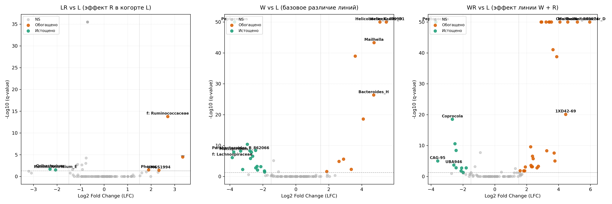

# Домашнее задание 1: Анализ профиля 16S рРНК микробиома мышей (QIIME 2)

Исследование таксономической структуры, биоразнообразия и дифференциального обилия бактериальных сообществ кишечника мышей в четырёх экспериментальных группах (L, LR, W, WR, n=29).

## Результаты анализа

### 1. Альфа-разнообразие
Фактор R выступает статистически значимым драйвером усложнения микробного ценоза:
- **Faith's PD (филогенетическое богатство):** Kruskal-Wallis $H = 19.62$, $p = 2.04 \times 10^{-4}$.
  - L ($5.85 \pm 0.61$) $\to$ LR ($7.10 \pm 0.21$), $p = 0.0003$
  - W ($5.97 \pm 0.97$) $\to$ WR ($8.03 \pm 0.75$), $p = 0.0023$
- **Shannon Index (энтропия и выравненность):** Kruskal-Wallis $H = 20.11$, $p = 1.61 \times 10^{-4}$.
  - L ($5.12 \pm 0.18$) $\to$ LR ($5.69 \pm 0.14$), $p = 0.0006$
  - W ($4.66 \pm 0.36$) $\to$ WR ($5.63 \pm 0.28$), $p = 0.0012$

### 2. Бета-разнообразие (PERMANOVA)
Многомерный дисперсионный анализ подтвердил достоверную изоляцию всех 4 экспериментальных групп:
- Общий тест: $pseudo\text{-}F = 29.0$, $p = 0.001$ для Unweighted UniFrac, Weighted UniFrac и Bray-Curtis.
- Все попарные сравнения между группами строго достоверны ($q \le 0.0020$).

### 3. Таксономия на уровне типов и соотношение Firmicutes / Bacteroidota
- В когорте **W** обнаружена массивная колонизация провоспалительными таксонами: *Campylobacterota* (22.89%), *Desulfobacterota_I* (8.14%) и *Proteobacteria* (5.66%), которые суммарно составляют свыше 36% биома, но отсутствуют в когорте L (<0.2%).
- **Фактор R** наполовину снижает экспансию *Campylobacterota* ($22.89\% \to 11.54\%$) и нормализует уровень *Firmicutes_A* ($32.66\% \to 57.80\%$).
- Соотношение **F/B ratio:** L — 5.28; LR — 7.60; W — 1.36; WR — 2.65.

### 4. Дифференциальный анализ родов (ANCOM-BC)
- **Маркеры дисбиоза линии W:** резкий рост *Helicobacter_D* ($\text{LFC} = +5.48$), *Helicobacter_C* ($\text{LFC} = +5.10$), *Bacteroides_H* ($\text{LFC} = +4.72$) и *Escherichia* ($\text{LFC} = +3.36$) на фоне падения мукозо-протективных *Mucispirillum* ($\text{LFC} = -3.77$) и *Lachnospiraceae* ($\text{LFC} = -3.86$).
- **Эффект фактора R:** обогащение продуцентов короткоцепочечных жирных кислот (бутирата/пропионата) — семейств *Ruminococcaceae* ($\text{LFC} = +2.71$), *Muribaculaceae* ($\text{LFC} = +3.65$) и рода *Odoribacter* ($\text{LFC} = +5.18$).

